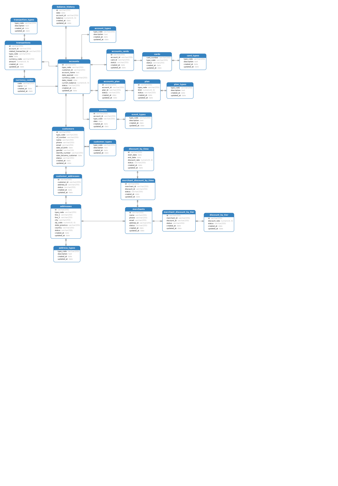

# The database for E-Cash

### To run:
mvn liquibase:update

### To drop data
mvn liquibase:dropAll

### Default configuration:
url=jdbc:postgresql://localhost:5434/ecash

username=ecash

password=ecash

### Diagram

